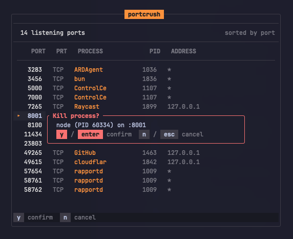

<p align="center">
  
</p>

<h3 align="center">portcrush</h3>
<p align="center">Beautiful TUI port manager.</p>

<p align="center">
  <a href="LICENSE"></a>
</p>

---

A single-binary TUI that lists active ports and lets you kill them instantly. Also works as a CLI, just pass port numbers directly.

## Install

```
brew install arthurrmp/tap/portcrush
```

```
cargo install portcrush
```

## Usage

```
portcrush
```

Or kill ports directly:

```bash
portcrush 3000
# :3000 — killed node (PID 12345)

portcrush 3000 5173 8080
# :3000 — killed node (PID 12345)
# :5173 — killed node (PID 12346)
# :8080 — nothing listening
```

## Keybindings

| Key | Action |
|-----|--------|
| `j`/`k` or `Up`/`Down` | Navigate |
| `Enter` or `x` | Kill process |
| `r` | Refresh |
| `s` | Cycle sort (port / name / pid) |
| `/` | Filter |
| `Esc` | Clear filter |
| `q` | Quit |

## License

[MIT](LICENSE)
